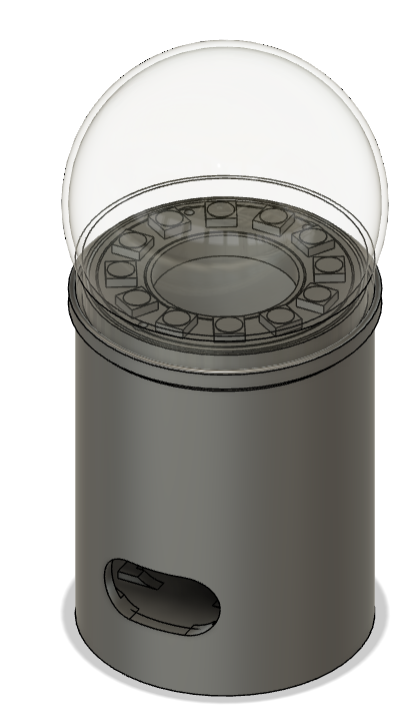

# Lampi

**Verk í vinnslu hjá Fab Lab Akureyri**

## Markmið

Búa til snjalllampa til að nýta til kennslu í Fab Lab. 

## Íhlutir

- ESP32C3
- Neopixel hringur (12LED, RGBW)
- Nokkrir vírar
- 3D prentaður rammi og kúpull
- random íhlutur 

## Uppsetning

- Setja upp Visual Studio Code
- Setja up PlatformIO
   - Viðbót fyrir [VScode](https://docs.platformio.org/en/latest/integration/ide/vscode.html)
- Opna Lampi.io með [platformIO](https://platformio.org/)   
- Ýta á `Build` sem býr til ýmsar skrár
- Laga línu í `AsyncWebSocket.cpp` [sjá neðar](https://github.com/hanndoddi/Lampi/tree/main#villa-%C3%AD-aspasyncwebserver)
- Framkvæma þessi skref:
    1. Build filesystem Image
    2. Upload filesystem Image
    3. Upload and monitor

|  | 
|:--:| 
| *Skref* |

## TODO: 

- _Útbúa verkefnalýsingu og efni fyrir rafmagns/forritunarnámskeið_
- Endurskrifa rútur (e. _routes_) með AJAX til að 
    - Slóð í vafra haldist eins
    - Nótera endanlega API punkta

## Eiginleikar

- [x] Vefviðmót
- [x] Þægilegt hýsisnafn (e. _hostname_)
- [ ] API
- [x] Breytilegt birtustig
- [x] Velja lit
- [ ] Nokkrar fyrir fram ákveðnar stillingar
    - [x] Rólegt
    - [ ] Norðurljós?
    - ...

## Myndir

|  | 
|:--:| 
| *Í vinnslu* |

|  | 
|:--:| 
| *Vefviðmót* |

|  | 
|:--:| 
| *Módel, í vinnslu* |

## Nótur

### Villa í ASPAsyncWebServer 

Sjá: https://github.com/me-no-dev/ESPAsyncWebServer/pull/1142

í `AsyncWebSocket.cpp` þarf að breyta eftirfarandi:

    IPAddress AsyncWebSocketClient::remoteIP() {
        if(!_client) {
            return IPAddress(0U);
        }
        return _client->remoteIP();
    }

svona: 

    IPAddress AsyncWebSocketClient::remoteIP() {
        if(!_client) {
            return IPAddress();
        }
        return _client->remoteIP();
    }
